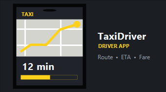

<p align="center">
  
</p>

<h1 align="center">TaxiDriver Reloaded</h1>

<p align="center">
  <strong>Your city. Your shift. Your reputation.</strong><br>
  A universal free-roam taxi mode for BeamNG.drive, presented as an immersive mobile driver app.
</p>

<p align="center">
  <a href="https://github.com/noteMASTER11/TaxiDriverReloaded/releases/tag/v3.0.0-beta"></a>
  
  
  
</p>

<p align="center">
  <a href="https://github.com/noteMASTER11/TaxiDriverReloaded/releases/tag/v3.0.0-beta"><strong>Download 3.0.0 Beta</strong></a>
</p>

---

> **3.0.0 Beta:** this prerelease introduces a new synchronized HUD transport, Connected Phone performance controls, lazy vehicle integration, and expanded diagnostics. Existing 2.25.1 settings and progress remain compatible.

TaxiDriver Reloaded turns ordinary free roam into a complete driving-work loop. Go online from the in-game phone, choose a passenger ride or cargo delivery, complete the route, protect your rating, and continue into the next queued order.

It is not a fixed scenario and does not depend on hardcoded pickup lists for one map. Orders are generated from the current road network, making the mode usable across compatible official and community maps.

## Highlights

### A taxi app inside the game

- Start and stop taxi work directly from the `TaxiDriverHUD` UI App.
- Use a phone-inspired interface with animated screens, loaders, notifications, settings, and a separate minimized dashboard with a full map and essential trip statistics.
- Keep dispatch messages, penalties, passenger chat, and order confirmations inside the phone instead of the global game notification tray.
- Scale interface text to suit the size of your UI layout.

### Optional LAN companion phone

- **Experimental:** share TaxiDriver over a trusted local network and run the actual `TaxiDriverHUD` UI App on a physical phone or tablet through BeamNG's External UI transport and TaxiDriver's in-mod LAN bridge.
- Keep one Lua-owned gameplay state across the in-game and external instances. Refreshing the browser reconstructs the interface without resetting the active order, shift, economy, profile, or settings.
- Use an external-only Canvas surface for the route, complete exported road graph, terrain tiles when available, and live vehicle heading; every other screen, control, localization, and sound is provided by the same UI App used in the game.
- While an external phone is connected, the in-game app automatically becomes a single phone button and can be reopened temporarily at any time.
- Use this feature only on a trusted local network: BeamNG External UI provides direct access to the running game.

> Connected phone requires free TCP port **8085** and inbound private-network permission for `BeamNG.drive.x64.exe`. If the port is occupied or the game is denied network access by the firewall/security suite, the Web UI will not open on another device. Sharing is session-only and starts disabled every time.

### A living dispatcher

- Browse a gradually populated pool of **10–12 mixed requests**.
- Compare passenger, pickup deadline, trip time, distance, fare, rating bonus, Calmness, scheduled stops, estimated income per minute, and income per kilometre/mile.
- Sort requests by highest fare, nearest pickup, shortest duration, or best income per kilometre/mile.
- Choose between regular rides, rush requests, multi-stop work, and long-distance cargo deliveries.
- Rush requests offer additional pay but impose a tighter arrival target.
- Multi-stop requests create longer routes and require a **10-second stationary wait** at every intermediate stop.
- Sparse maps automatically avoid multi-stop orders when there are not enough safe route points.

### Long-distance cargo deliveries

- Each dispatcher pool targets **5–7 delivery requests**, mixed with regular, rush, and multi-stop passenger work.
- Cargo weighs between **2 and 250 kg** and is physically added to the active vehicle after loading, affecting handling and real powertrain consumption.
- Cargo above **15 kg** earns a linear weight premium, rising from 0% at the threshold to **+150% at 250 kg** before the driver-rating bonus.
- Deliveries cover routes from approximately **2 to 25 km**; their pre-weight base rate is slightly lower than comparable passenger work.
- Passenger-specific penalties do not apply: only collisions can damage the package.
- Each impact can add **1–35% package damage**, proportionally reducing the delivery payout; cumulative damage is capped at 100%.
- Package damage from 5% upward lowers the delivery review, reaching **1 star at 100% damage**.
- Dedicated loading, unloading, cargo-weight, damage, progress, notification, and review states are available in all eight interface languages.

### Universal and more believable destinations

- Pickup and drop-off points are generated dynamically from the active map.
- Trips are designed around practical route distances of approximately **1–25 km**.
- The generator prefers suitable roadside locations near buildings and bus stops when map data is available.
- Lane-aware placement aims for the road edge instead of dropping passengers into inner traffic lanes.
- Controlled positional variation reduces visibly repeated pickup locations.
- Spatial route history treats A-to-B and B-to-A as the same pair and prioritizes distinct map areas for more than half of every dispatcher pool.
- On sparse maps, diversity checks relax after several attempts so order generation can continue instead of stalling.

### Passengers with personality

- Passenger names are generated from English first-name and surname pools.
- The selected passenger may send **one to three emoji-only messages** while you drive to pickup.
- Each short conversation keeps a coherent randomly chosen mood and needs no language-specific message text.
- Every passenger starts with a random **mood**, shown as an expressive emoji with a percentage.
- Smooth progress gradually improves the passenger's mood, while late pickup, speeding, collisions, harsh maneuvers, and unnecessary fuel stops can lower it.
- Each mood change briefly flashes a green or red border around the emoji. Positive recovery is capped at 40 percentage points above the passenger's initial mood.
- Relaxed passengers may ignore some penalty events; sensitive passengers react more strongly to poor driving.
- A passenger who becomes critically dissatisfied can demand an immediate stop and end the ride early.
- Optional Random Events let passengers cancel before pickup, change the destination, request an additional stop, or offer a conditional tip for careful or quick driving. Delivery orders can carry fragile cargo with increased impact sensitivity.

### Shift overview

- Going online starts a shift that tracks completed work, gross income, fuel costs, penalty losses, net income, and average rating.
- The start screen summarizes the previous shift with its ride count, net income, and average rating.
- The primary action is localized as **Start Shift** in all eight interface languages.

### Persistent driver profile

- Edit the driver's full name and date of birth, with age calculated automatically.
- Choose an avatar from a large emoji grid directly in the phone.
- Passenger reviews are retained without a fixed limit and displayed with pagination.
- Profile analytics chart rating and wallet balance changes from ride to ride.
- The Vehicles tab groups completed rides, earned income, accumulated distance, average income and rating, passenger/cargo split, penalty and cargo-damage losses, fuel use/cost, and profit per distance by the model/configuration name shown in BeamNG's vehicle selector.
- Vehicle history can be sorted by mileage, income, or completed trips; unused vehicles with zero completed work are not retained.
- Rating, balance, reviews, and profile details persist independently of the mod archive.

### Driving quality that affects the fare

- The phone calculates an estimated fare before the trip.
- Speeding, collisions, harsh maneuvers, and late pickup can reduce the final payment.
- Every applied reduction appears in the in-phone **Penalties** list with its value and event details.
- Passenger fare reduction is capped at **50%**; cargo damage can reduce a delivery payout by up to 100%.
- Difficulty presets range from **Elementary** to **Professional**.
- A strong driver rating increases earnings, reaching a **15% rating bonus at 5.00**.
- The persistent driver rating is displayed on a five-star progress scale from `0.00` to `5.00`.
- The active-trip screen shows projected final payout, fuel sufficiency, the next scheduled stop, and a compact violation summary that expands on demand.

### Navigation built for the phone

- A rectangular native minimap appears only during active driving phases.
- The native minimap adapts to speed, while Connected Phone uses a closer, smoother, phone-specific zoom curve that preserves local road detail.
- ETA is calculated using a city-driving reference speed of **40 km/h**.
- Arrival time, remaining distance, route progress, speed limit, stop markers, and trip metrics remain visible around the map.
- The ride footer shows current fuel or charge to two decimal places and an approximate remaining driving range.
- A narrow odometer below the phone clock tracks the current vehicle configuration in kilometres or miles.
- The start screen shows the selected vehicle's BeamNG preview, selector name, odometer, fuel/charge, and estimated range. Clicking the card opens BeamNG's native vehicle selector.
- Road-surface route arrows can be disabled in settings.
- A configurable 0–30 km/h overspeed-warning margin (10 km/h by default) turns the speed-limit sign red and plays a one-shot alert while the trigger is exceeded.

### Pickup, stops, and continuous work

- Reaching a pickup or destination opens a dedicated boarding or alighting screen.
- The mod attempts to open and close a passenger-side door for extra immersion; unsupported vehicles continue safely without it.
- Cargo loading and unloading similarly attempts to operate a trunk, tailgate, or cargo-door trigger on a best-effort basis.
- Pickup deadlines can produce a gradually increasing late-arrival penalty.
- When a trip is more than 80% complete, another offer may appear for a limited time.
- Accepted offers enter a queue and never overwrite the current passenger.
- Expired offers disappear and another may arrive after a short delay.
- Gameplay pause freezes pickup, rush, stop, transfer, and floating-offer countdowns without penalizing the driver.
- Going offline requires a two-second hold; cancelling with a passenger aboard requires confirmation and applies the displayed difficulty-based rating penalty.
- Vehicle reset clears both the active trip and the queued request to prevent stale state.

### Optional realistic economy

- Enable **Realistic mode** on the start screen before going online.
- Combustion vehicles begin the shift with 5% fuel; electric vehicles begin with 30% charge.
- Stop at a compatible fuel station to open the in-phone refueling screen.
- Use the persistent **Refuel** action to route to the nearest compatible station while browsing orders or during an active ride.
- Maps without a compatible station open a clearly marked magic-fuel fallback that reuses the ordinary tank, wallet, slider, timing, and passenger-wait rules.
- Fuel routing temporarily takes priority without discarding the passenger, queued ride, or dispatcher state.
- A fuel stop with a passenger aboard applies a small wait penalty balanced by difficulty, passenger Calmness, and driver rating.
- Choose fuel or energy with a slider limited by tank capacity and the current TaxiDriver wallet balance.
- Use quick-fill presets for +5 L, +10 L, 50%, or Full and review before/after level, unit price, total cost, projected range, and whether the result is sufficient for the active order.
- Refueling is timed and animated: liquid fuel flows at 2 L/s, while EV charging adds 4 percentage points per second. The process follows simulation time and pauses with the game.
- The realism economy uses a Midwest-oriented gasoline price of $0.93/L and a public fast-charging price of $0.50/kWh.
- Fuel prices and energy units follow BeamNG.drive's station economy data.
- Going offline restores the normal free-roam station interface without changing the vehicle's remaining fuel or charge.

## Settings

Open the gear icon in the TaxiDriver phone to configure:

- language, full-interface scale from 80% to 180%, metric/imperial units, and 12/24-hour time;
- Elementary, Easy, Standard, Professional, or fully adjustable Custom difficulty;
- independent penalty switches for speeding, collisions, harsh maneuvers, late pickup, fuel stops, rush bonuses, and cargo damage;
- passenger/delivery order ratio and dynamic minimap zoom intensity;
- optional Random Events, independently persisted from Realistic Mode;
- TaxiDriver sound volume with a random sound test button and separate toggles for all seven sound groups, including an iOS-compatible Connected Phone audio engine;
- silent mode;
- road-surface route guidance.

Settings are grouped into expandable categories and apply automatically. The red Cheat Zone can set a rating, add test reviews or wallet funds, adjust new-order payouts, and reset driver statistics with confirmation.

The interface includes English, German, French, Italian, Spanish, Polish, Russian, and Ukrainian. English is used by default unless another language is explicitly remembered.

Settings, profile details, and driver progress are stored separately outside the mod at:

```text
%LOCALAPPDATA%\BeamNG\BeamNG.drive\current\settings\TaxiDriver\settings.json
%LOCALAPPDATA%\BeamNG\BeamNG.drive\current\settings\TaxiDriver\difficulty.json
%LOCALAPPDATA%\BeamNG\BeamNG.drive\current\settings\TaxiDriver\profile.json
%LOCALAPPDATA%\BeamNG\BeamNG.drive\current\settings\TaxiDriver\progress.json
%LOCALAPPDATA%\BeamNG\BeamNG.drive\current\settings\TaxiDriver\vehicles.json
%LOCALAPPDATA%\BeamNG\BeamNG.drive\current\settings\TaxiDriver\lan.json
```

`difficulty.json` contains the Custom difficulty sliders and individual penalty switches. It can be copied between installations and shared as a player-made difficulty preset. Invalid or unsupported files are replaced with safe defaults.

If any file is missing, invalid, or uses an unsupported schema, safe defaults for that file are restored and saved automatically.

All application sounds—including clicks, online/offline cues, passenger messages, penalties, and new offers—follow BeamNG.drive's **Interface Volume** setting in real time and can be reduced further with TaxiDriver's own volume slider.

## Runtime architecture

`taxiDriver.lua` is the BeamNG extension entry point and gameplay orchestrator. Domain state is delegated to focused modules:

- `persistence.lua` owns settings, difficulty, profile, progress schemas, validation, and JSON I/O;
- `routePlanner.lua` owns road-graph routing, semantic stop discovery, level caches, and recently used stops;
- `vehicleControl.lua` owns telemetry commands, forced-stop/freeze control, and passenger/cargo access triggers;
- `vehicleHistory.lua` owns current-vehicle detection, per-configuration odometers, previews, ride counts, and income;
- `shiftTracker.lua` owns current/previous shift totals and fuel-adjusted net income;
- `tripEvents.lua` owns optional cancellations, route changes, additional stops, conditional tips, and fragile cargo;
- `lanBridge.lua` owns the Connected Phone server, proxy, live state, and map export;
- `delivery.lua`, `passengerMood.lua`, `routeDiversity.lua`, `offerGenerator.lua`, and `identity.lua` contain their corresponding gameplay domains.

The main extension is guarded by a regression check for LuaJIT's 200-local main-chunk limit. Runtime modules are also compiled with LuaJIT 2.1 during release verification.

## Installation

1. Download `taxidriver.zip` from the [3.0.0 Beta release](https://github.com/noteMASTER11/TaxiDriverReloaded/releases/tag/v3.0.0-beta).
2. Place the archive directly in:

   ```text
   %LOCALAPPDATA%\BeamNG\BeamNG.drive\current\mods\
   ```

3. Start BeamNG.drive and open a free-roam session.
4. Open the UI Apps editor and add **TaxiDriverHUD**.
5. Press **Start Shift** on the phone and wait for dispatch to populate the order list.

> Do not keep packed and unpacked copies of the same mod version active at the same time. Duplicate Lua and UI files may cause loading conflicts.

## Compatibility

- Target game version: **BeamNG.drive 0.38.6**.
- Designed for official and community maps with a usable road network.
- Best results are obtained on maps with detailed road, building, and bus-stop data.
- Vehicle door animation is best-effort and depends on the selected vehicle.

## Repository structure

```text
lua/ge/extensions/taxiDriver/       Runtime controller and focused Lua modules
lua/vehicle/extensions/             Lazy-loaded vehicle telemetry and physical cargo mass
ui/modules/apps/TaxiDriverHUD/      Phone UI, styles, localizations, assets, and sounds
tools/TaxiDriver.LanProbe/          Automated real-subnet HTTP/WebSocket bridge test
tests/ui/                            Mock-state visual and interaction test harness
mod_info/TaxiDriver/                BeamNG mod metadata
```

Order discovery is processed incrementally across simulation updates. Complex road graphs may therefore take longer to fill the dispatcher, but route scanning no longer performs a large synchronous workload in a single frame.

Packaged builds are distributed through [GitHub Releases](https://github.com/noteMASTER11/TaxiDriverReloaded/releases) and are intentionally excluded from the source tree. See the repository [Changelog](CHANGELOG.md) for detailed release notes.

## Credits

Special thanks to **Incognito**, creator of the original [TaxiDriver mod](https://www.beamng.com/resources/taxidriver.28763/).

The original concept of a dedicated BeamNG.drive taxi experience—including passenger rides, an economy, and a driver-rating system—belongs to Incognito. TaxiDriver Reloaded is an independent reimagining and technical redevelopment for modern free roam. It is not an official update to, or replacement for, the original resource.
